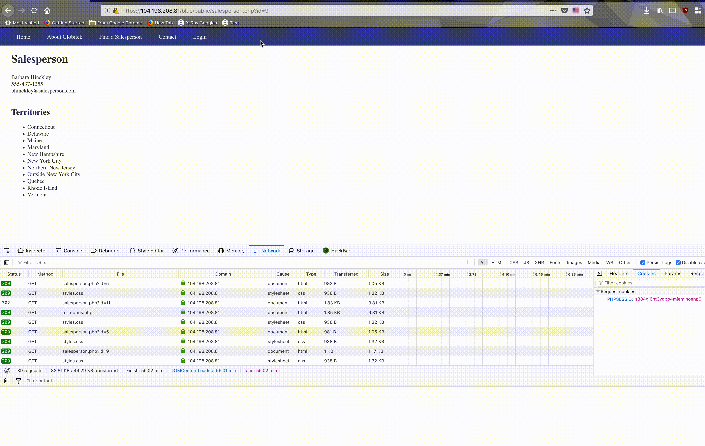

# Project 8 - Pentesting Live Targets

Time spent: **9** hours spent in total

> Objective: Identify vulnerabilities in three different versions of the Globitek website: blue, green, and red.

The six possible exploits are:
* Username Enumeration
* Insecure Direct Object Reference (IDOR)
* SQL Injection (SQLi)
* Cross-Site Scripting (XSS)
* Cross-Site Request Forgery (CSRF)
* Session Hijacking/Fixation

Each version of the site has been given two of the six vulnerabilities. (In other words, all six of the exploits should be assignable to one of the sites.)

## Blue

Vulnerability #1: Session Hijacking
  - Using exposed PHP session tools and changing the session id allows for hijacking other users' sessions. In this instance, this was accomplished by logging into the pperson account, then viewing the PHPSessionID; next, I opened a private window and went to the public site, then to the PHPSession tool to change the private window's session ID to the admin's ID. This immediately logs the private session into the admin account. 
  - [ ] GIF Walkthrough: 
    

Vulnerability #2: SQL Injection
  - Using the basic SQLi proof (' OR SLEEP(5)=0--') shows that the blue site is vurnerable to SQLi. Constructing the URL as follows will replicate it: ```https://104.198.208.81/blue/public/salesperson.php?id=%27%20OR%20SLEEP(5)=0--%27```
  - [ ] GIF Walkthrough: 
    

## Green

Vulnerability #1: Username Enumeration
  - Validity of attempted login username leaks due to differences in formatting, such as bold typeface for valid usernames.

Vulnerability #2: Cross-Site Scripting
  - XSS was impossible to miss; the contact form did not sanitize input, meaning code could be injected and executed when the admin or authenticated user accessed the feedback page.


## Red

Vulnerability #1: IDOR 
  - Data of "fired" employee and recently hired employee who are unlisted can be indirectly accessed by manipulating the id paramater in the Get request. When attempted this manipulation on the green and blue sites, they simply redirect to the territories page. 

Vulnerability #2: CSRF
  - Submitting a malicious webpage into the contact section is CSRF, and the authenticated user activates when they view the page.


## Notes

The green website had no filter at all on its contact field, so I made a button that edited the cookie name when clicked. Obviously, this was just for the fun of it (and because it was funny to see the buttons rendered on the admin side), and this "attack" could be much stealthier if the attacker used onload or the like.

```html
<div id="dontClick" style="background-color: lime; margin: auto;">Click Me!</div>
<script>
dontClick.addEventListener('click', () => {
	document.cookie="name=the Internet is scary!";
	dontClick.innerHTML = document.cookie;
});
</script>
```


